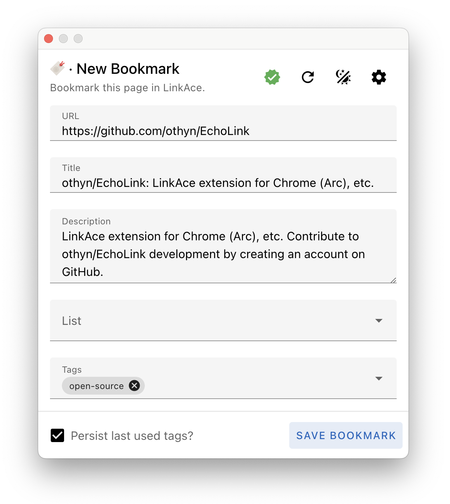

# EchoLink

> A modern Chrome (Arc, Chrome, Chromium) extension to save a bookmark in [LinkAce](https://github.com/Kovah/LinkAce). Built in Vue 3, Vuetify 3, Typescript & Vite. Boilerplate provided by [create-chrome-ext](https://github.com/guocaoyi/create-chrome-ext).

Heavily inspired by [Creling/Yet-Another-LinkAce-Extension](https://github.com/Creling/Yet-Another-LinkAce-Extension), an excellent extension which I'd been using for years. I wanted to PR a few new features and bugfixes, but found it was too out of date, requiring a serious re-write from the ground up. Thus, this project now existing. I like to think of it as the spiritual successor to that extension.

<div align="center">
    
</div>

## Installing

1. Make sure you are running a `Node.js` version between **14** and **19**.
2. Run `yarn install` to install the project dependencies.

## Developing

Run the following to get going with local development:

```shell
# Traverse into the project
$ cd EchoLink

# Run the local Vite hot reload environment
$ yarn dev
```

### Loading an unpacked extension

1. Set your Chrome based browser to ['Developer mode'](https://developer.chrome.com/docs/extensions/get-started/tutorial/hello-world#load-unpacked).
2. Click ['Load unpacked'](https://developer.chrome.com/docs/extensions/get-started/tutorial/hello-world#load-unpacked), and select the `echolink/build` folder.

## Packing

When things are ready to ship to production:

```shell
$ yarn build
```

The contents of the `build` folder will be the extension, all bundled up and ready to be submitted to the Chrome Web Store, then follow the steps to ['Publish in the Chrome Web Store'](https://developer.chrome.com/webstore/publish).
